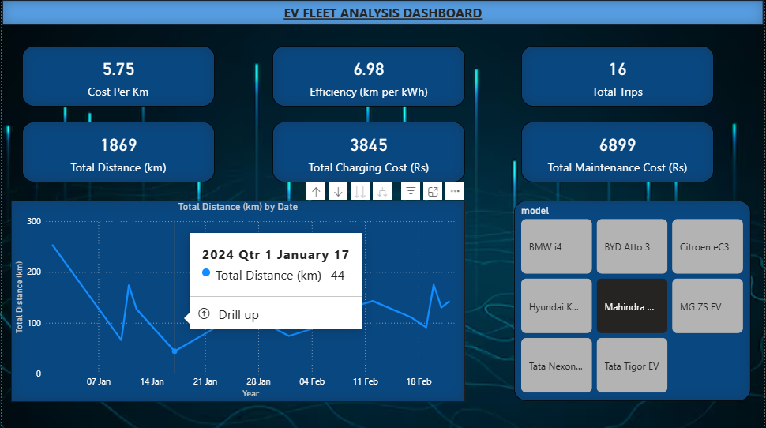
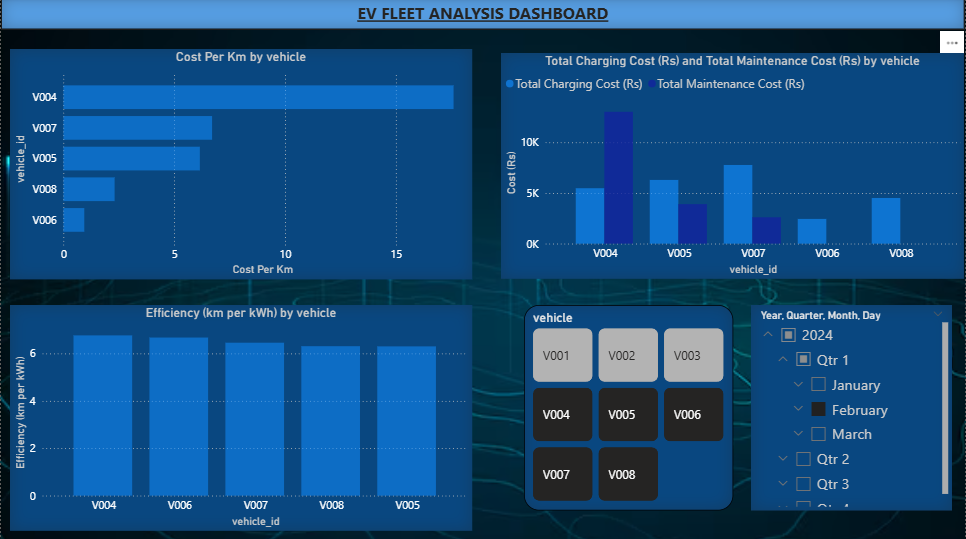

# EV Fleet Analytics Dashboard

## Project Overview
EV Fleet Analytics Dashboard designed to analyze the operational performance and cost efficiency of an Electric Vehicle (EV) fleet.  

The dashboard enables monitoring of trip activity, charging costs, maintenance expenses, and overall vehicle efficiency to support data-driven fleet management decisions.

---
## Objectives
- Monitor total fleet distance and trip activity  
- Track charging and maintenance expenses  
- Calculate cost per kilometer for each vehicle  
- Compare efficiency (km per kWh) across vehicles  
- Identify high operating cost vehicles  

---

## Key Metrics Implemented
- Total Distance (km)  
- Total Trips  
- Total Charging Cost (Rs)  
- Total Maintenance Cost (Rs)  
- Cost per Km  
- Efficiency (km per kWh)  

---

## Tools & Technologies Used
- **Power BI** – Data Visualization  
- **DAX** – KPI and metric calculations  
- **PostgreSQL** – Data storage and structuring  
- **Excel** – Data preparation  

----

## Dashboard Preview

### Fleet Overview Dashboard

### Vehicle Performance Dashboard

---

## Key Insights
- Certain vehicles show significantly higher cost per km due to maintenance expenses.  
- Charging cost contributes heavily to total fleet operating cost.  
- Vehicle efficiency remains relatively consistent with minor variation across models.  

---

## Business Impact
- Optimize operational cost  
- Monitor vehicle performance  
- Improve fleet efficiency  
- Support strategic decision-making  
